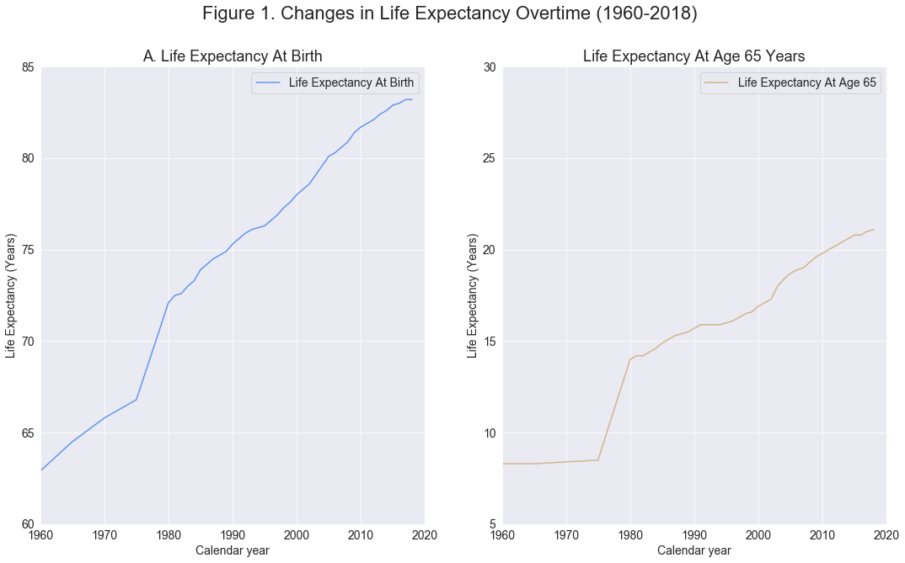
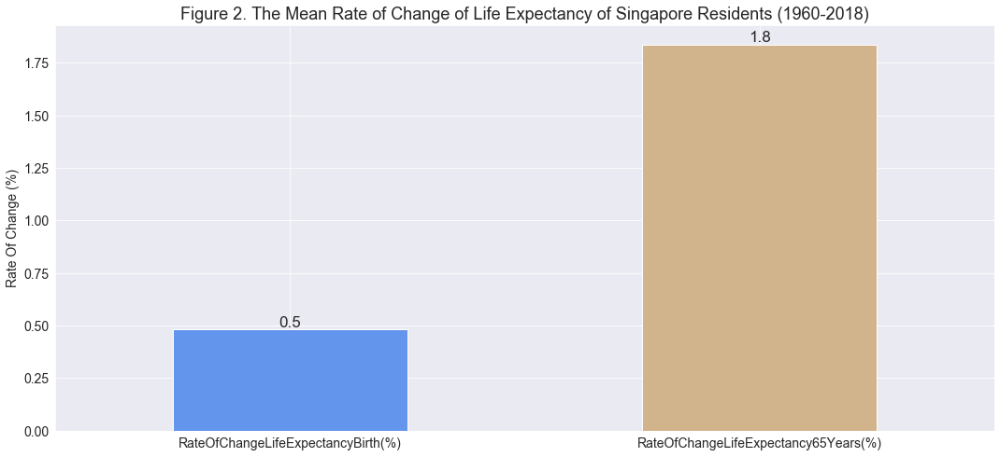
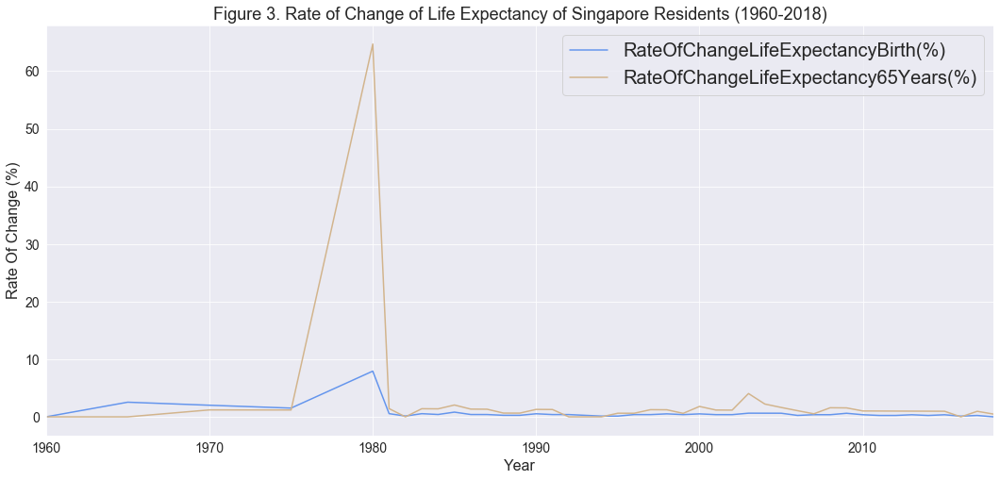
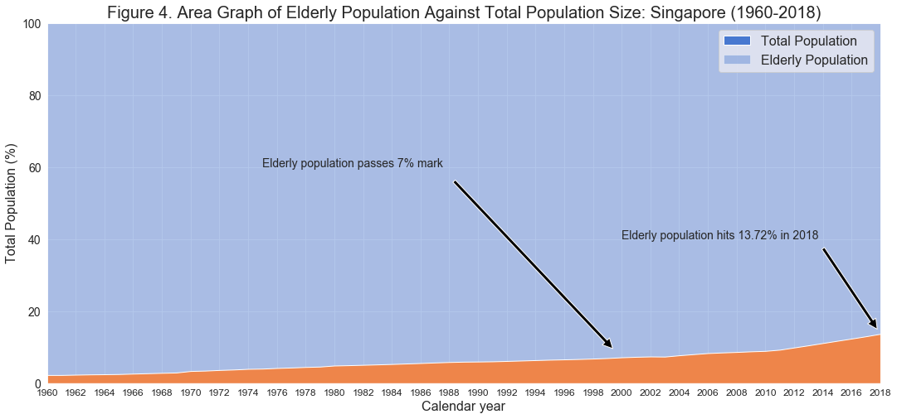
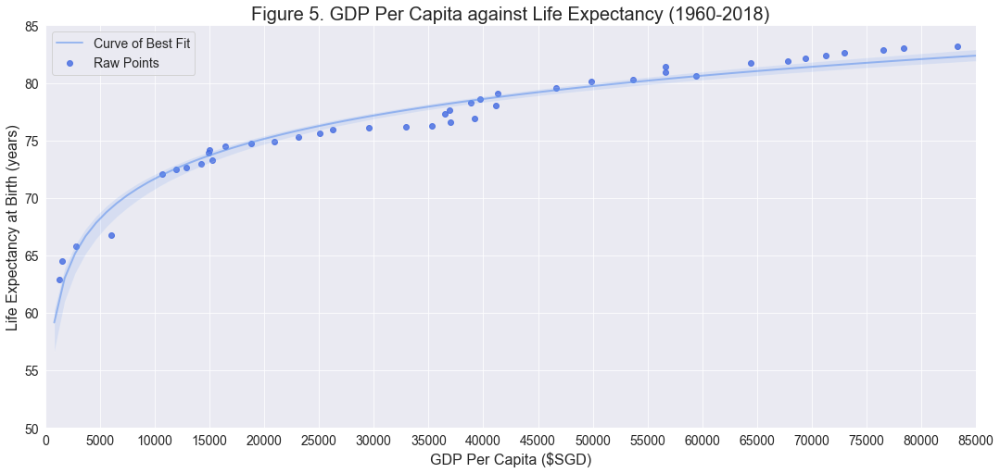
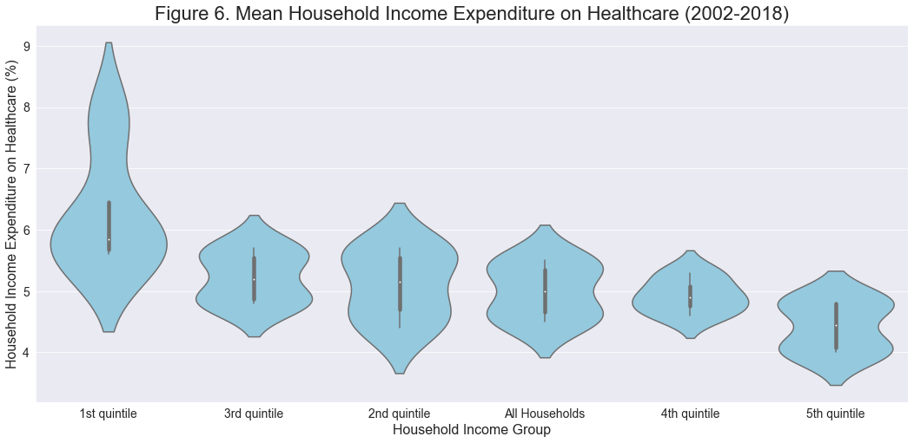
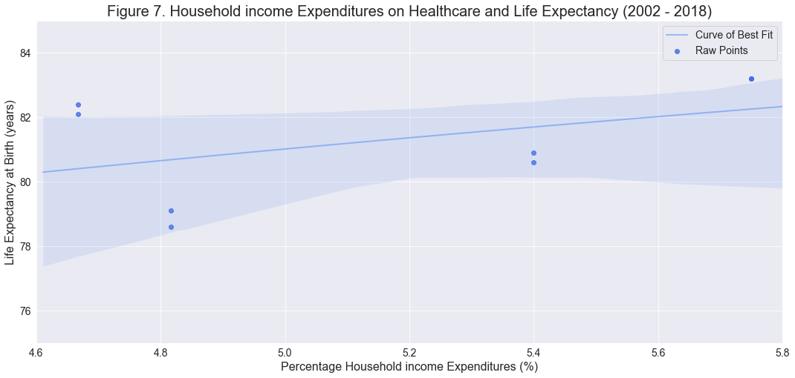
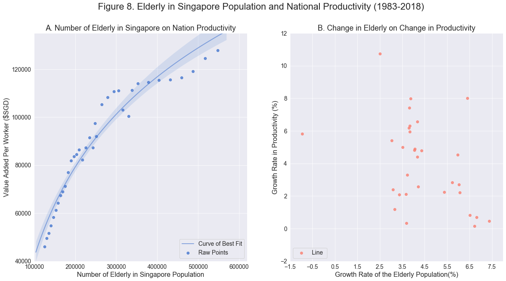
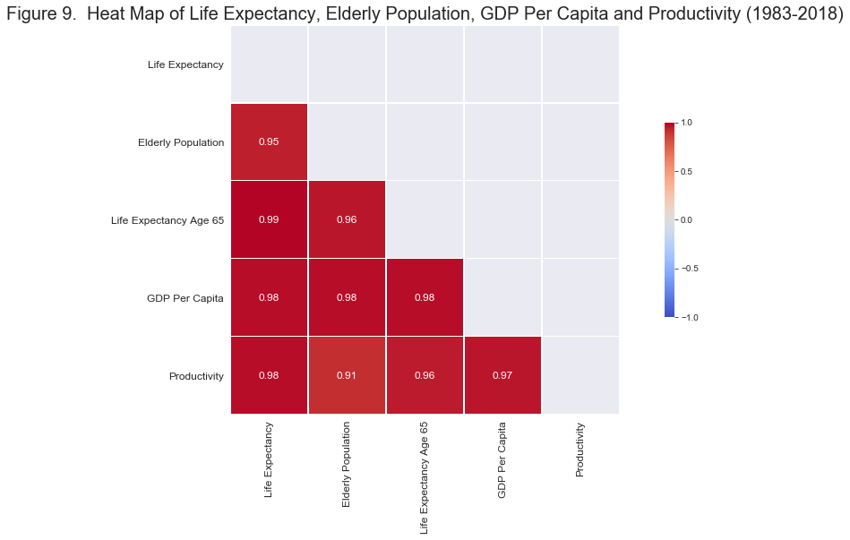
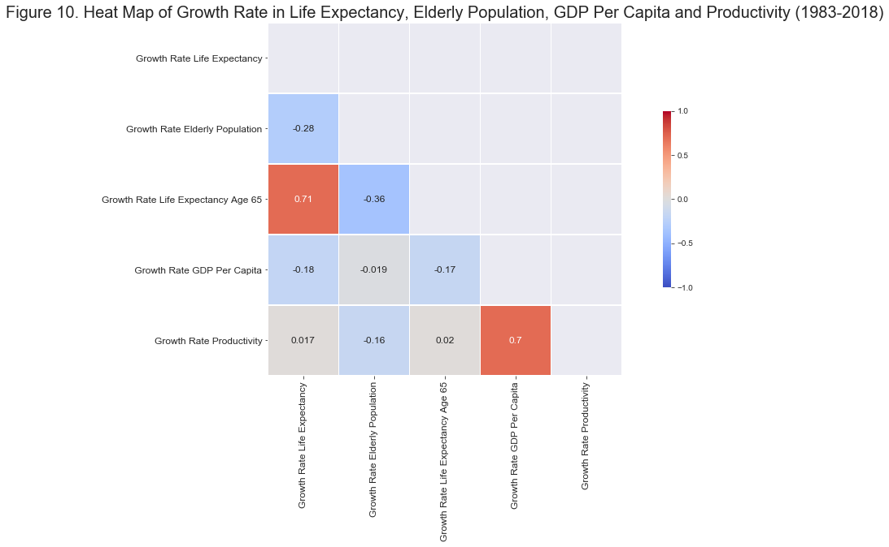

**By Chakrit Thong Ek, Master Of Analytics, Massey University School of Business (Singapore)**

#### Code: [Link to this project](https://github.com/thongekchakrit/life-expectancy-SG/blob/master/notebook/The_Effect_of_Rising_Life_Expectancy.ipynb)

## Abstract 

Aging population may present challenges to many nations around the world, however, the effect of aging population in Singapore remains unanswered. While many studies show that an aging population can increase total dependency ratio of a country, thereby, reducing the proportion of working-age group, the effect of an aging population and its driving factor in Singapore remains debatable. In this study, the effect of an aging population and factors contributing to increase in life expectancy were examined. Our result shows that life expectancy increases as GDP per capita increases, however, life expectancy flattens out when GDP per capita reaches $10,717 per capita. In addition, our results showed that in Singapore, an increase in elderly population does not correlate to a reduction in GDP per capita. 

## 1. Introduction

The improvement in healthcare around that world has led to a direct payoff in longer and better lives for millions. However, with a low fertility rate, the world’s population is experiencing a change in population age-structure, leading to an increase in the number and proportion of elderlies in many nations (United Nations, 2019). An increase in the proportion of elderlies in a nation could potentially increase the total dependency ratio of a country, leading to a reduction in the proportion of working-age group. This could present a challenge to the country's economy as the nation's productivity may decrease (Adamis *et al.*, 2014).

With the social and health changes since its independence after the separation from Malaysia in 1965, Singapore may be facing a concomitant demographic transition like many nations in the world (Lim *et al*., 2013). In this study, we will find out the demongraphic make up of Singapore, what drives the improvement in life expectancy and the effect of demongraphic shift on Singapore's productivity.

### 1.1. Analysis Questions

Demographic makeup of Singapore.
- What is the changes in life expectancy overtime?
- What percentage of the population consist of the elderly?

What drove the increase in life expectancy?
 - Is there a correlation with the life expectancy and GDP per capita?
 - Is the life expectancy and percentage of household income expenditure on healthcare relative?

Effects of demographic transition on economy
 - How relative is the elderly population and the added value per worker?
 - Are there any correlation between life expectancy, elderly population, GDP Per Capita and the productivity of Singapore?

## 2. Data Sources, Methods, Results and Analysis  

### 2.1. Datasets

The datasets use in this project has been gathered from two sources. The majority of datasets has been taken from [data.gov.sg](https://data.gov.sg/) and some have been taken from [singstat.gov.sg](https://www.singstat.gov.sg/). 

Below are the datasets used in this project:

1. [Life Expectancy at Birth and Age 65 years, Annual](https://data.gov.sg/dataset/life-expectancy-by-sex-annual?view_id=06123d4e-31ed-40f0-a4c8-04c164629d22&resource_id=a75832e1-630f-42fc-a1cf-e5c8a0724227) (January 1, 1960 to December 31, 2018)
<br>
2. [Singapore Residents By Age Group, Ethnic Group And Gender, End June, Annual](https://data.gov.sg/dataset/resident-population-by-ethnicity-gender-and-age-group?resource_id=d5d35678-cd15-4f43-b347-d671d1870655) (January 1, 1957 to December 31, 2018)
<br>
3. [Per Capita GNI and Per Capita GDP At Current Prices, Annual](https://data.gov.sg/dataset/per-capita-gni-and-per-capita-gdp-at-current-market-prices-annual) (January 1, 1960 to December 31, 2018)
<br>
4. [Household Healthcare Expenditure](https://data.gov.sg/dataset/household-healthcare-expenditure) (January 1, 2002 to December 31, 2017)
<br>
5. [Value Added Per Worker In Chained (2015) Dollars, By Industry (SSIC 2015), Annual](https://data.gov.sg/dataset/value-added-per-worker-in-chained-2015-dollars-by-industry-ssic-2015-annual)  (January 1, 1983 to December 31, 2019)

In response to the questions above, data wrangling and exploratory data analysis was be performed to analyze the datasets. The following modules will be used throughout this study: Pandas, numpy, seaborn, matplotlib and matplotlib.pyplot.
 
```
The steps taken for data wrangling has been left out. 

The full process can be found using the link at the end of essay.
```

### 2.2.  Demongraphic Makeup of Singapore

In this section, the trend of life expectancy of Singapore residents from 1960 to 2018 was evaluated. In addition, the demographic of Singapore elderly population was analyzed. 

This section was divided into two segments:
 1) Change in life expectancy in Singapore from 1960 to 2018
 2) Changes in the elderly population from 1960 to 2018.

In this study, we will follow the international classification of classifying an elderly person: people age 65 years and older is considered as an elderly (Arthur and Vaupel, 1984).

**2.2.1. Changes in Life Expectancy from 1960 to 2018**




* The trend of life expectancy at birth and at age 65 years have increased from 1960 to 2018.
* There was a sharp increase in both life expectancies from 1975 to 1980.
* Following the sharp increase in 1975-1980, life expectancies follow a gradual increase.
* From 1960-1975, life expectancy saw no increase, this could mean that medical intervention was not advance for reducing mortalities of the elderly after age 65 years old.
* There must be a major change in factors such as economy, lifestyle, society (safety), healthcare or medical care, to cause a sudden increase in life expectancy from 1975-1980.
* Throughout 1960 to 2018, the increase in the value of life expectancy at birth was much greater compared to the life expectancy at age 65.
* The increase in life expectancy at birth is relative to the increase in life expectancy at age 65 years.

Although the increase of life expectancy at birth was greater than the increase of life expectancy at age 65 years, to find the trend of life expectancy, the rate of change must be considered. 





* The mean rate of change of life expectancy at age 65 years is 3.5 times higher than the mean rate of change of life expectancy at birth (Figure 2).
* From 1975 to 1980, there was a sharp increase in life expectancy at age 65 years (Figure 3), with a value of approximately 64%.
* Similarly, between 1975 to 1980, life expectancy at birth (Figure 3) increased by 7.9%.
* From 1980 to 2018, the rate of change for life expectancy at birth were modest, while, the rate of change at age 65 years to fluctuated.
* In 2003, a sharp increase in life expectancy at age 65 is seen(Figure 3).
* Life expectancy at birth was 66.8, 72, and 83.2 years in the years 1975, 1980 and 2018 respectively (Figure 1).
* The highest increase in life expectancy at birth happened between 1975 and 1980.
* Life expectancy for residents at age 65 years was 8.5, 14 and 21.10 years in the year 1975, 1980 and 2018 respectively(Figure 2).
* The highest increase in life expectancy at age 65 happened between 1975 and 1980.
* Life expectancy at birth has a mean increase of 0.5% throughout 1960 to 2018 (Figure 3).
* Life expectancy at age 65 has a mean increase of 1.8% throughout 1960 to 2018 (Figure 3).
* There was 0% increase in life expectancy at birth in 2018.

With a mean increase of 0.5% yearly and a spike increase in 1980, the growth rate for life expectancy at birth is slowing down (Figures 2 and 3). This means that after 2018, the growth rate for life expectancy at birth will be low. Similarly, the increase in life expectancy at age 65 years will slow down as well. This observation is supported by Foreman et al. (2018) and his team, who stated that by 2040, the forecast of life expectancy in Singapore will hit approximately 85 years.  

After 2018, the life expectancy for Singapore Residents will continue to increase at an extremely small margin. This is due to the fact that we are reaching the limit of human age. Life expectancy is unlikely to go beyond 95 years unless there is a fundamental change in our ability to delay the aging process (Crimmins, 2015).

The increase in Life Expectancy from 1975-1980 was the greatest. There was an increase of 7.93% in life expectancy at birth and 64.7% in life expectancy at age 65 years. Between that period, Singapore might have experienced major changes to their socioeconomic status or healthcare resources leading to a sharp increase in life expectancy. Before we take a look at the socioeconomic or healthcare resource changes over time, we will look at the changes in Singapore's demographic.

**2.2.2.  Changes in percentage of elderly population in Singapore (1960 to 2018)**

In Singapore, a person who is 65 years or older is classified as an elderly. In this section, we will analyze the change in the percentage of the elderly population against the total population from 1960 to 2018. 

The analysis of this percentage signifies population ageing due to declining fertility rates and rising life expectancy. The changes in the percentage of elderly population can give us insights into raising new demographic challenges such as an increase in the total dependency population and a shrinking labor force. 



* There was a steady increase in the elderly population during the period 1960-2018.
* Elderly population passes the 7% mark between the period 1999-2000.
* In 2011, the growth rate of elderly population increase, this can be seen by the increase in gradient in Figure 4.
* In 2018, 13.72% of Singapore population was made up of the elderly.
* The elderly population have increased from 2.28% in 1960 to 13.72% in 2018.
* Elderly numbers increased by 1360.94% from 37,500 in 1960 to 547,854 in 2018.

The elderly population in Singapore has been steadily raising since the 1960. Between the year 1999 and the year 2000, Singapore's elderly population passed the 7% mark. This shifted Singapore's demographic transition to an ageing population. The number of elderly in Singapore continued to raise steadily until 2011, where the number of elderlies increased by a large amount. 

This can be seen by the increase in gradient of Figure 4 in the year 2011. In summary, there was a large amount of increase in elderly population in Singapore. Initially the population consisted of 2.28% of elderly, however in 2018, the percentage of elderly in the population increased to 13.72%. This increase in percentage amount to a total increase of 1360.94% in the number of elderlies from 1960 to 2018. In the next section, the contributing factor leading to this demographic shift was explored.

### 2.3. What drove the improvement in life expectancy?
In this section, we will find out whether Gross Domestic Product Per Capita has any correlation with life expectancy at Birth. In addition, we will examine any correlation between household income expenditure on healthcare relative with life expectancy (at birth). 

This section has been divided into two parts:
1) Life expectancy and GDP Per Capita
2) Life expectancy and household expenditure on healthcare.

**2.3.1. Life Expectancy and GDP Per Capita**



* There is a positive correlation between GDP per capita and life expectancy.
* Life expectancy in Singapore increased the most when its GDP per capita increased from \$1,310 to \$10,717
* Life expectancy growth rate decreased after GDP per capita reach \$10,717
* Figure 5 shows that GDP per capita is not the only determinant affecting life expectancy
* After Singapore obtained GDP per capita of \$10,717, the tread in life expectancy shows that GDP per capita does not have a strong effect on improvement of life expectancy.
* Figure 5 follows Preston curve

The relationship between life expectancy and GDP per capita has been studied for years, and it is well known that life expectancy has an association with higher income (Cervellati and Sunde, 2011). Having a higher income can allow people to afford better healthcare and nutrition, which is considered as the primary determinant of historical and contemporary mortality decline (Lutz and Kebede, 2018). Since the 1960s, Singapore has made a tremendous improvement in GDP per capita, in doing so, Singapore had increased its resident's life expectancy from 62.90 years in 1960 to 83.20 years in 2018. The growth in life expectancy increased the greatest when GDP per capita elevated from \$1,310 to \$10,717 within the period of 1960 to 1980. During this period, there was a total increase of 9.2 years in life expectancy, which consisted of 45% in the total increment of life expectancy.

After having a GDP per capita of \$10,717, the relationship between GDP per capita and life expectancy seems to flattened out (Figure 5). This shows that GDP per capita is not the only determinant for increasing life expectancy and that for countries with high GDP per capita, GDP per capita has little associated change in life expectancy (Preston, 2007). The increase in life expectancy is complex and there are a wide variety of determinants which can affect it, such determinants are technological progress in public health interventions, hygiene measures, oral hydration therapy, access to healthcare resources and food supply (Brown, 2015). In the next section, the effect of household expenditure on healthcare will be explored on change in life expectancy.

**2.3.2 Household Income Expenditure on Healthcare and Life Expectancy**



* There are no outlier data point for any quintile group.
* The value of all households expenditure on healthcare is not the mean percentages of 1st to 5th quintile group.
* Household in 1st quintile group spend the highest percentage of their income on healthcare compared to other quintile groups.
* Some household in the 1st quintile group spend as little as 5.6% of their income on healthcare, while others spend up to 7.8% of their income.
* The median of 2nd and 3rd quintile group spend approximately the same percentage of their income on healthcare. 
* The difference between 2nd and 3rd quintile group is that 2nd quintile group has a larger deviation in income expenditure on healthcare.
* The 5th quintile group spends the least percentage of their income on healthcare expenditure.
* Households within the 4th quintile group has a similar spending pattern, majority of the household spends approximately 4.9% of their income on healthcare.

Lower quintile groups spend more percentages of their income on healthcare compared to higher income groups (Figure 6). 1st quintile group had a wide distribution of income expenditure on healthcare, while 4th quintile group had similar spending pattern on healthcare. The 2nd and 3rd quintile group spent approximately the same percentage of their income on healthcare. 

In summary, although 1st quintile group spent the largest percentage of their income on healthcare, the top spender on healthcare belonged to 5th quintile. The logic behind that is that 5th quintile group have a higher income margin compared to 1st quintile group, and 4% of what the income was can be much larger than 5.6% of income earned by people in 1st quintile group.



* Percentage household income expenditure on healthcare and life expectancy has an r-square value of 0.22.
* The correlation between household income expenditure on health care and life expectancy is weak positive.
* There are very few recorded data for household income expenditure on healthcare.

One of the most important contributing factor in increasing life expectancy is healthcare. Here an analysis of the link between household income expenditure on healthcare and life expectancy was conducted between the year 2002 to 2018. The visualization in Figure 7 shows that as household income expenditure increases, life expectancy increases. However, the correlation shown was a weak positive correlation. This suggests that by 2002, the percentage of household income expenditure on healthcare may have little effect on life expectancy in Singapore. 

By 2002, Singapore was a developed nation with an aging population, hence, spending more on healthcare may have little effect on life expectancy. This is in-line with Obrizan and Wehby (2018), who theorize that increasing health spending in countries that have a low life expectancy would bring a larger marginal return compared to increasing longevity in a country with high life expectancy.

However, the result in Figure 7 might not be as reliable due to insufficient data. More data on household income expenditure on healthcare should be obtained to generate a better result.

### 2.4. Effects of demographic transition on economy
Lastly, we will evaluate the effects of demographic transition on Singapore's economy. 

This section was seperated into two parts: 
1) The effect of increase in elderly population on nation productivity
2) The evaluation of correlation of life expectancy, elderly population, GDP Per Capita, household income expenditure on healthcare and the productivity of Singapore.

**2.4.1. Elderly population and nation productivity**



An aging population is a concern shared by many countries around world, that in the absence of offsets from another source, the labour force proportion of the population may not be able to maintain the economy output per capita (Denton and Spencer, 2019). The result of this study shows that as although growth rate of elderly population has a negative correlation to the growth rate in productivity (Figure 8.B), productivity will continue to grow (Figure 8.A), albeit at a slower rate. 

The number of elderly in a population is not the main determinant for productivity. In Singapore, the labour age limit is 67 years old. Hence, it is interesting to note that in 2014, within this age group, there were 54.1% and 29.5% of employed male and female elderly workers (Department of Statistics Singapore, 2017).

**2.4.2. Were there any correlations between life expectancy, elderly population, GDP Per Capita and the productivity of Singapore?**



* The correlation between life expectancy to the elderly population, life expectancy at age 65, GDP per capita and productivity were 0.95, 0.99, 0.98 and 0.98 respectively.
* The correlation between the elderly population to life expectancy, life expectancy at age 65 , GDP per capita and productivity were 0.95, 0.96, 0.98 and 0.91 respectively.
* The correlation between life expectancy at age 65 to life expectancy, elderly population, GDP per capita and productivity were 0.99, 0.96, 0.98 and 0.96 respectively.
* The correlation between GDP per capita to life expectancy, elderly population, life expectancy at age 65 and productivity were 0.98, 0.98, 0.98 and 0.97 respectively.

From 1983 to 2018, Figure 9 showed that there was a strong positive correlation between life expectancy, life expectancy at age 65 years,elderly population, GDP per capita and productivity. 

The lowest correlation coefficient in Figure 9 was 0.91 and the highest correlation coefficient was 0.99. This analysis had not taken other determinates and time factor into account. Life expectancy, life expectancy at age 65 years,elderly population, GDP per capita and productivity had been on the rise since 1983, hence, if there was any negative correlation towards 2018, the result will not be reflected on this matrix. To better understand the relationship between these variables, the yearly growth rate for each variable should be analyzed instead.



- There was a negative correlation between growth in life expectancy and elderly population, and GDP per capita (Figure 10). 
- There was no correlation between growth in life expectancy and growth in productivity.
- There was a strong correlation between the growth in life expectancy and life expectancy at age 65 years.
- There is a negative correlation between the growth in life expectation at age 65 and the growth was elderly population.
- A negative correlation between growth in elderly population and productivity can be seen. While no correlation can be seen between growth in elderly population and GDP per capita.
- There is a high positive correlation between growth in productivity and GDP per capita.

There was a strong correlation between the growth in life expectancy ar birth and life expectancy at age 65, this can be seen in Figure 1 as both expectancies increased drastically between 1983 and 2018.

It was interesting to note that there was a negative correlation between the growth in the elderly population and the growth in life expectancy at birth and at age 65 years. This did not mean that there will be a reduction in the value of the decreasing variable, it meant that the growth rate will decrease. From looking at the trend of life expectancy (Figure 1) and elderly population (Figure 4), in 2018, the elderly population rate was growing at 13.72% while life expectancy had no growth. Hence, the higher growth in elderly rate, the lower the growth in life expectancy, however, this correlation only reflected the inability of human to age past a certain point. 

The growth in life expectancy at birth and at age 65 years reduces growth in GDP per capita, and, had no correlation with productivity. The higher the growth rate of life expectancy (at birth or at 65 years), the longer people will tend to live. And when more people fall into the dependency age group compared to labour working-age, GDP per capita will decrease.

The relationship between growth rate of GDP per capita and life expectancy weakens after reaching a certain point. This was in agreement with Figure 5 and was supported by Biciunaite (2014) who stated that for developed nations, when GDP per capita exceeds US$40,000, the relationship between GDP per capita and life expectancy becomes inverse. Similarly, as the growth rate in elderly population increases, the growth rate in productivity decreases. 

There was a strong relationship between growth in productivity and growth rate of its GDP per capita. This meant that if the productivity of the average worker rises, there will be an increase in GDP per capita.

## 3. Conclusion
Key findings:
1. The growth in life expectancy at birth is slowing down.
2. Life expectancy at age 65, continues to grow, however, the growth rate will soon decrease.
3. The growth in life expectancy will decrease and will reach a maximum of 85-90 years by 2040. 
4. For life expectancy to get past 90 years, a fundamental change in our ability to delay aging process must be made.
5. Singapore demographic shifted into aging population between the years 1999-2000 when it past the 7% elderly population mark.
6. In 2018, 13.72% of Singapore population was made up of the elderly.
7. Elderly numbers increased by 1360.94% from 37,500 in 1960 to 547,854 in 2018.
8. There is a positive correlation between GDP per capita and life expectancy.
9. Life expectancy in Singapore increased the most when its GDP per capita increased from \$1,310 to \$10,717
10. From 1960 to 1980, there was a total increase of 9.2 years in life expectancy, which consisted of 45% in the total increment of life expectancy.
11. Life expectancy growth rate decreased after GDP per capita reach \$10,717.
12. The increase of life expectancy is not only attributed to GDP per capita, other factors that can affect life expectancy are technological progress in public health interventions, hygiene measures, oral hydration therapy, access to healthcare resources and food supply.
13. The correlation between household income expenditure on health care and life expectancy was weak positive.
14. The more number of elderly in population, the growth rate in productivity seems to be slowing down.
15. When the growth rate for elderly was high, growth rate in productivity was decreases.
16. The optimization growth rate of both the elderly population and productivity seems to be between 3.5-4.5%.
17. The growth rate in elderly population and productivity had a weak negative correlation, this meant that when growth rate of elderly population was high, productivity will continue to grow, albeit at a slower rate.
18. Aging population does not affect much of Singapore's productivity, this was because in Singapore, the elderly population are encouraged to work.
19. 54.1% and 29.5% male and female elderly between the ages 65-69 were employed in 2014.
20. Singapore has one of the highest old-age employment rates and Singapore government offers grants to incentivise the creation of elderly-friendly work processes and workplace design (Rogerson and Stacey, 2018).

In summary, Singapore has a ignorable negative correlation of -0.019 between the growth rate of the elderly population and the growth rate of GDP per capita. The economy of Singapore will continue to grow even when the number of elderly raises. This can seen in Figure 9 and is attributed to the fact that Singapore has one of the highest old-age employment rates. Singapore government has has been tackling the challenges of aging through national public policy as well as regional initiatives, backed by state, charity and private funding (Rogerson and Stacey, 2018). This creates an environment for which the elderly can contribute to the economy while aging healthily.

## 4. References

- Adamis, D., Devaney, A., Shanahan, E., Mccarthy, G. & Meagher, D. 2014. Defining ‘recovery’ for delirium research: a systematic review. Age and Ageing, 44, 318-321.
- Biciunaite. 2014. Economic Growth and Life Expectancy – Do Wealthier Countries Live Longer? [Online]. Euromonitor International. Available: https://blog.euromonitor.com/economic-growth-and-life-expectancy-do-wealthier-countries-live-longer/ [Accessed 25 Feb 2020].
- Brown, G. C. 2015. Living too long: the current focus of medical research on increasing the quantity, rather than the quality, of life is damaging our health and harming the economy. EMBO reports, 16, 137-141.
Cervellati, M. & Sunde, U. 2011. Life expectancy and economic growth: the role of the demographic transition. Journal of Economic Growth, 16, 99-133.
- Chan, M. F. & Kamala Devi, M. 2012. Factors Affecting Life Expectancy: Evidence From 1980-2009 Data in Singapore, Malaysia, and Thailand. Asia Pacific Journal of Public Health, 27, 136-146.
- Crimmins, E. M. 2015. Lifespan and Healthspan: Past, Present, and Promise. The Gerontologist, 55, 901-911.
- Denton, F. & Spencer, B. 2019. Effects of Population Aging on Gross Domestic Product per Capita in the Canadian Provinces: Could Productivity Growth Provide an Offset? Canadian Public Policy, 45, 1-16.
- Department of Statistics Singapore. 2017. Age-Sex Specific Resident Labour Force Participation Rate [Online]. Available: https://data.gov.sg/dataset/age-sex-specific-resident-labour-force-participation-rate [Accessed 21 Feb 2020].
- Department of Statistics Singapore. 2019. M810091 - Births And Fertility Rates, Annual [Online]. Singstat.gov: Singapore Government. Available: https://www.tablebuilder.singstat.gov.sg/publicfacing/createDataTable.action?refId=13273 [Accessed 21 Feb 2020].
- Lim, R. B. T., Zheng, H., Yang, Q., Cook, A. R., Chia, K. S. & Lim, W. Y. 2013. Ethnic and gender specific life expectancies of the Singapore population, 1965 to 2009 – converging, or diverging? BMC Public Health, 13, 1012.
- Lutz, W. & Kebede, E. 2018. Education and Health: Redrawing the Preston Curve. Population and development review, 44, 343-361.
- Obrizan, M. & Wehby, G. L. 2018. Health Expenditures and Global Inequalities in Longevity. World Development, 101, 28-36.
- Preston, S. H. 2007. The changing relation between mortality and level of economic development. International Journal of Epidemiology, 36, 484-490.
- Rogerson, A. & Stacey, S. 2018. Successful Ageing in Singapore. Geriatrics (Basel, Switzerland), 3, 81.
- United Nations. 2019. Aging [Online]. United Nation. Available: https://www.un.org/en/sections/issues-depth/ageing/ [Accessed 17 Feb 2020].

## Code

* [Link to this project](https://github.com/thongekchakrit/life-expectancy-SG/blob/master/notebook/The_Effect_of_Rising_Life_Expectancy.ipynb)